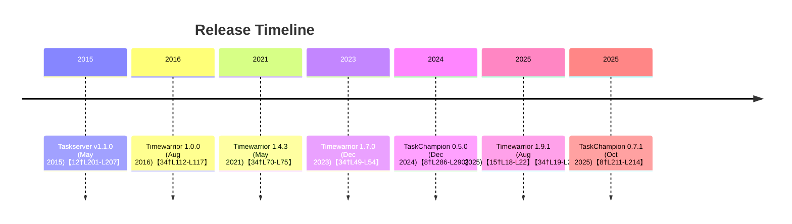

# Executive Summary  
This report collates official information on **Taskserver (taskd)**, **TaskChampion Sync Server**, and **Timewarrior** to guide the design of a Model Context Protocol (MCP) that integrates these tools with LLMs.  We gathered project homepages, documentation, and release data to summarize versions, installation methods, configuration, and common workflows.  Notably, Taskserver (the old Taskwarrior sync daemon) was last released v1.1.0 in 2015【12†L201-L207】 and is now deprecated for Taskwarrior 3; TaskChampion is the modern HTTP-based sync server with recent releases (v0.7.1 on Oct 11, 2025【8†L211-L214】) and provides Docker/bi­nary distributions; and Timewarrior is a CLI time-tracking tool whose latest stable release is 1.9.1 (Aug 27, 2025)【15†L18-L22】【34†L19-L24】.  We describe installation (packages, source, containers), configuration paths (config files, data directories), key commands and workflows (e.g. `task sync`, Taskserver admin commands, time-tracking commands), and integration points (Taskwarrior’s on-modify hook for Timewarrior【27†L11-L19】, and Taskwarrior-TaskChampion syncing【26†L35-L43】).  We also note extensibility (e.g. Taskwarrior user-defined attributes and hook scripts) and limitations (Taskserver only supports Taskwarrior 2.x【10†L311-L319】).  A mermaid timeline and comparative tables illustrate version histories and feature differences.  

In addition to the tools reference, we outline governance and documentation templates for the MCP project:  
- **docs/Tools_Usage_Reference.md** – summaries, tables and integration notes for Taskd, TaskChampion, and Timewarrior.  
- **docs/llm_context/assumptions_and_ideas.md** – records all development assumptions (with ADR:0 example and guidance to track unveri­fied assumptions).  
- **docs/llm_context/AGENTS.md** – requirements for LLM-generated contributions (must mark LLM authorship, model/harness used).  
- **docs/CONTRIBUTING.md** – branching model and workflow (dev/qa/main with feature branches and PRs, semantic versioning, license guidance).  
- **docs/ADRs.md** – template for architecture decision records, with an initial example entry (timestamp, context, decision, pros/cons).  

We recommend licensing the project under an existing permissive license (e.g. MIT or BSD-3-Clause) to allow private/commercial use with required attribution to the original author, as discussed below.  

**Checklist of files to add:**  
- `docs/Tools_Usage_Reference.md` (tools overview and comparisons)  
- `docs/llm_context/assumptions_and_ideas.md` (tracking assumptions, ADR example)  
- `docs/llm_context/AGENTS.md` (LLM contribution rules)  
- `docs/CONTRIBUTING.md` (branching, PR/QA/main workflow, semantic versioning)  
- `docs/ADRs.md` (template and first ADR entry)  
- (Ensure `README.md` links to `docs/`, including subfolders `llm_context/`, `manuals/`, `references/`.)  

All documentation should be placed under `docs/`, with LLM-specific context in `docs/llm_context/`, user/technical manuals in `docs/manuals/`, and references (official docs, articles) in `docs/references`.  

# Tools Usage Reference  

## Overview of Projects  
| Tool                  | Project Homepage                                          | Documentation                         | Latest Stable Release (Date)         | License       | Notes                     |
|-----------------------|-----------------------------------------------------------|---------------------------------------|--------------------------------------|--------------|---------------------------|
| **Taskserver (taskd)**| Gothenburg Bit Factory (Taskd page)【14†L8-L13】          | taskwarrior.org (Taskd docs)【13†L79-L83】 | v1.1.0 (May 10, 2015)【12†L201-L207】   | MIT          | Sync server for Taskwarrior 2.x; **deprecated** in TW3【10†L309-L318】【32†L159-L164】. Requires TLS/certs.  |
| **TaskChampion Sync** | Gothenburg Bit Factory (TaskChampion page)【17†L17-L24】  | TaskChampion documentation【17†L17-L24】  | v0.7.1 (Oct 11, 2025)【8†L211-L214】    | MIT          | Modern HTTP sync server for Taskwarrior 3+【26†L35-L43】. Provides Rust binaries and Docker images【20†L18-L27】.  |
| **Timewarrior**       | timewarrior.net【15†L9-L17】                              | timewarrior.net/docs                  | 1.9.1 (Aug 27, 2025)【15†L18-L22】【34†L19-L24】 | MIT          | CLI time tracker. Integrates with Taskwarrior via on-modify hook【27†L11-L19】. Uses JSON DB in user directory. |

- **Taskserver (taskd)** is a C++ server (distributed under MIT) for synchronizing Taskwarrior tasks (Taskwarrior calls it *taskserver* or *taskd*).  The official website notes “Taskserver is a lightweight, secure server providing multi-user, multi-client access to task data”【14†L8-L13】.  The latest and final release is **1.1.0** (May 10, 2015)【12†L201-L207】.  It is compatible only with Taskwarrior 2.x【10†L309-L318】 and is *not* used by Taskwarrior 3 (which switched to TaskChampion).  The code repo is archived (no active development).  
- **TaskChampion Sync Server** is a Rust-based HTTP sync server.  It implements the new TaskChampion sync protocol for Taskwarrior, and acts as a reference server (other clients should interoperate)【17†L17-L24】. Each release publishes binaries (SQLite and Postgres versions) and Docker images【21†L18-L27】【20†L18-L27】. The latest version is **0.7.1** (Oct 11, 2025)【8†L211-L214】.  It requires a running database (SQLite or Postgres) and listens on a TCP port (default 8080).  
- **Timewarrior** is a command-line time-tracking tool.  It is open source (MIT license) and integrates loosely with Taskwarrior. Timewarrior’s homepage states “Timewarrior is free and open source software that tracks time from the command line”【15†L11-L18】. The latest stable release is **1.9.1** (Aug 27, 2025)【15†L18-L22】【34†L19-L24】. Timewarrior has detailed online documentation for installation, configuration, and usage. It stores data in per-user directories following the XDG spec (e.g. `~/.config/timewarrior/timewarrior.cfg` and `~/.local/share/timewarrior/data`)【24†L19-L29】【29†L19-L27】.  

## Releases and Versions (Timeline)  

- *Taskserver (taskd)*: v1.1.0, 2015-05-10【12†L201-L207】. (No updates post-2015.)  
- *TaskChampion Sync Server*: v0.5.0 (2024-12-15), v0.6.0 (2025-03-01), v0.6.1 (2025-03-03), v0.7.0 (2025-07-31), v0.7.1 (2025-10-11)【8†L211-L214】【36†L25-L29】. (Frequent minor releases during 2024–2025.)  
- *Timewarrior*: 1.0.0 (2016-08-21), 1.4.3 (2021-05-28), 1.7.0 (2023-12-24), 1.9.1 (2025-08-27)【34†L19-L24】【34†L70-L75】.  

## Installation Methods  
- **Packages:** All three tools are packaged by major distros. Taskserver packages exist in Arch, Debian, etc., though Taskserver is old. Timewarrior has packages in Arch (`pacman -S timew`), Debian (`apt-get install timewarrior`), Fedora (`dnf install timew`), macOS (brew, MacPorts), etc【16†L19-L27】. TaskChampion does not have official distro packages yet; it is typically installed from source or Docker.  
- **Source:** Taskserver can be built with CMake (see its GitHub `INSTALL` docs【10†L371-L379】). TaskChampion is built with Rust/Cargo (stable Rust required)【5†L344-L352】【5†L360-L369】. Timewarrior is built with CMake as well (CMake/GCC, minimal dependencies; see [16] for steps).  
- **Containers:** TaskChampion provides official Docker images (SQLite and Postgres) tagged on GitHub Container Registry【20†L18-L27】. Example run:  
  ```bash
  docker run -d --name=taskchampion \
      -p 8080:8080 \
      -e RUST_LOG=info \
      -v /path/to/data:/var/lib/taskchampion-sync-server/data \
      ghcr.io/gothenburgbitfactory/taskchampion-sync-server:latest
  ```  
  The images use environment variables for config (see below). There are no official containers for Taskserver or Timewarrior (but Timewarrior could be containerized manually).  

## Configuration and File Locations  
- **Taskserver (taskd):**  Uses a data root directory (`TASKDDATA` or `--data <root>`). Inside that root, Taskserver stores its data and a `config` file (top-level of data root) which can be managed with `taskd config`. The server’s behavior is controlled by `taskdrc` (typically `$TASKDDATA/taskdrc` or `$HOME/.taskdrc`) or by setting environment variables (e.g. `TASKDDATA`, see [32]). Config variables (CA cert, TLS keys, server address/port, etc.) are documented in the manpage【31†L24-L33】【31†L43-L52】. For example, default `server` address is `localhost:53589` and default `pid.file` is `/tmp/taskd.pid`【31†L84-L92】【31†L69-L77】. Certificates (client/server keys) must be generated for authentication.  
- **TaskChampion Sync Server:** Configuration is via command-line options or env vars. Key variables (with defaults) are: `LISTEN` (address:port, default `0.0.0.0:8080`), `DATA_DIR` for SQLite (default `/var/lib/taskchampion-sync-server/data`), `CONNECTION` for Postgres (LibPQ URI), `CLIENT_ID` (allowed client IDs), and `CREATE_CLIENTS` (boolean, default `true`)【20†L33-L42】. Also `RUST_LOG` controls logging. These are documented in the Docker and binaries docs【20†L33-L42】【21†L43-L53】. If using the Postgres image, one must pre-create the database schema as noted【20†L62-L64】.  
- **Timewarrior:** Follows the XDG directory spec since v1.5.0. By default:  
  - Config file: `~/.config/timewarrior/timewarrior.cfg` (or legacy `~/.timewarrior/timewarrior.cfg`)【24†L19-L27】【29†L19-L27】.  
  - Data files: `~/.local/share/timewarrior/data/*.data` (monthly data files, plus `tags.data`, `undo.data`)【29†L19-L27】.  
  The config can be edited directly or via `timew config`.  `TIMEWARRIORDB` env var can override the data directory (default is XDG path)【24†L19-L27】【29†L57-L65】.  Extensions (scripts) go under `~/.config/timewarrior/extensions/` by default, or legacy `~/.timewarrior/extensions/`.  

## Common Commands and Workflows  
- **Taskserver (taskd):** Key commands (see `taskd --help`【32†L26-L35】):  
  - `taskd init --data <root>`: Initialize a new server data store.  
  - `taskd config [--data <root>] [<name> [<value>]]`: View/modify config settings.  
  - `taskd server [--daemon]`: Start the sync server (reads certs/keys, listens for connections).  
  - `taskd add user <org> <user>` (and `group`, `org`): Manage orgs/groups/users.  
  - `taskd remove|suspend|resume user|group|org`: Manage existing entities.  
  - `taskd validate <JSON>`: Validate a sync data packet (for debugging).  
  - Other commands: `taskd diagnostics`, `taskd help`, `taskd client` (send raw request).  
  (See man page for details【32†L39-L48】【32†L49-L58】.)  
  Clients (Taskwarrior) will use `taskd sync` to push/pull tasks.  `taskd` commands can take `--data` or use `TASKDDATA`.  On first run, create an org/group/user and PKI keys. Config (including `server.address`, `server.cert`, `server.key`, etc.) is stored in the data root.  Most options can be overridden on the command line or via the `taskd config` command【32†L129-L137】【32†L133-L142】.  
- **TaskChampion Sync Server:** After building or pulling an image, run the `taskchampion-sync-server` binary (or Docker as above). It supports flags like `--listen`, `--data-dir`, `--connection`, `--allow-client-id`, etc【21†L43-L53】. For example, to listen on port 9000:  
  ```
  taskchampion-sync-server --listen 0.0.0.0:9000 --data-dir /srv/taskchampion
  ```  
  By default it allows all new clients. To restrict, use `--allow-client-id` or set `CLIENT_ID=...`, or disable auto-creation with `--no-create-clients`/`CREATE_CLIENTS=false`【21†L67-L76】.  Logging can be enabled with `RUST_LOG=info` for each request【21†L78-L85】. The server handles all HTTP sync endpoints as per the TaskChampion protocol (HTTPS can be added via reverse proxy). Taskwarrior clients use `task sync` to communicate. The server has no built-in UI.  
- **Timewarrior:** Common commands:  
  - `timew start [tags...]`: Start a new time tracking interval.  
  - `timew stop`: Stop the currently running interval.  
  - `timew resume`: Resume last interval.  
  - `timew add HH:MM[:SS] [tags]`: Log past time.  
  - `timew summary`: Show totals by day/week.  
  - `timew config <name> <value>`: Set a config option.  
  - `timew help`, `timew docs`, etc.  
  For example, `timew start ProjectX +feature` begins tracking “ProjectX” time. The **Taskwarrior-Timewarrior hook** ties these together: installing the `on-modify.timewarrior` hook (provided by Timewarrior) into `~/.task/hooks/` causes Taskwarrior commands to trigger time tracking【27†L49-L58】. E.g., `task 42 start` will run the hook, which in turn does `timew start` with appropriate tags. When the task is stopped or completed, the hook issues `timew stop`, recording the duration【27†L49-L58】.  This enables seamless integration: a Taskwarrior workflow can automatically create Timewarrior intervals【27†L67-L75】.  

## APIs, Protocols, and Syncing  
- **Taskserver Protocol (taskd):** Taskd uses a custom JSON-over-GnuTLS protocol (TCP). Clients (Taskwarrior 1/2) send encrypted JSON “replica” data. The server never sees plaintext tasks (they are encrypted by client key). Auth uses X.509 certs. The Taskserver man page notes that sending SIGHUP causes it to reload config【32†L63-L72】. Administrative interactions (`taskd config/add`) mutate the JSON store. Taskd’s official documentation and manpages are on Taskwarrior’s site (e.g. man pages for `taskd(1)`, `taskdctl(1)`, `taskdrc(5)`【13†L79-L83】【31†L24-L33】).  
- **TaskChampion Protocol:** TaskChampion uses an HTTP+JSON protocol described in its specification (linked from the docs)【17†L17-L24】【36†L40-L47】. Taskwarrior 3’s `task sync` command implements the TaskChampion client side【26†L35-L43】. The protocol uses client IDs (UUIDs) to identify replicas. All data uploaded to the server is encrypted with a symmetric key known only to the client. The documentation emphasizes that “the server does not have access to the encryption secret. The server sees only encrypted data and cannot read or modify tasks in any way”【18†L32-L40】. The TaskChampion server thus stores opaque encrypted data and simply distributes it. Clients periodically poll (`task sync`) or push changes via HTTP (POST to `/sync`). The server’s implementation is the reference; other clients should interoperate with it.  
- **Timewarrior Data:** Timewarrior has no network API; it is purely local. Its “extensions” directory can contain scripts (in many languages) that run at certain hook points (e.g. on date change, on running an interval, etc.). The Taskwarrior hook is one such extension. Internally, Timewarrior’s data files (monthly `.data`) are simply text logs of intervals. It offers an `undo` command that uses an `undo.data` file【29†L39-L47】. There is no official sync for Timewarrior itself (it can be synced via git/rsync of `~/.local/share/timewarrior`, but this is user-managed).  

## Extensibility and Customization  
- **Taskwarrior Hooks and UDAs:**  Since this MCP relies on Taskwarrior as the front-end, it can leverage Taskwarrior’s extensibility. Users can define UDAs (user-defined attributes) in `.taskrc` to annotate tasks (e.g. adding custom fields). Taskwarrior provides a Hooks API (V1 and V2) for running external scripts on events【13†L79-L83】【13†L87-L92】. The TaskChampion integration uses a hook. Other potential hooks: on-add, on-modify, on-filter, etc. For example, a hook script could call an LLM to annotate a new task or verify priority. Our MCP design should consider allowing such hooks or extension scripts.  
- **TaskChampion Custom Fields / Schema:** TaskChampion sync protocol does not impose a specific schema beyond Taskwarrior’s built-in fields and UDAs. It syncs whatever is in the Taskwarrior task object (including any UDAs). We plan to allow users to define schemas or specification files for how tasks should be generated by the LLM, with defined fields. (These would essentially define UDAs or pre-set values that LLMs will use when creating tasks.) The MCP installer should prompt for an initial schema or use a sample schema.  
- **Timewarrior Extensions:** Timewarrior supports “extensions” (scripts) placed under `~/.config/timewarrior/extensions/`【29†L47-L54】. The on-modify hook is one such extension delivered with Timewarrior. Other custom extensions can react to time changes or implement additional commands.  

## Interoperability and Workflows  
- **Taskwarrior ↔ TaskChampion:** As noted, Taskwarrior clients use TaskChampion for sync【26†L35-L43】. This means a user can add or modify a task on one machine, run `task sync`, and later run `task sync` on another machine to pull changes. The TaskChampion server simply acts as a relay of encrypted deltas. In practice:  
  1. User sets `taskd.server = <URL>` in `~/.taskrc` pointing to TaskChampion (e.g. `http://example.com:8080`).  
  2. User runs `task sync` after local changes; Taskwarrior handles encryption and HTTP upload.  
  3. On another replica, `task sync` downloads and merges changes.  
  Cloud storage (e.g. S3) is an alternative, but TaskChampion avoids cloud costs【26†L49-L57】.  
- **Taskwarrior ↔ Timewarrior:** With the on-modify hook installed (see above), there is a tight integration: starting a task in Taskwarrior automatically starts a time interval in Timewarrior, and completing/stopping a task stops the interval【27†L49-L58】. E.g.:  
  ```
  $ task add ProjectA +work
  Created task 174.
  $ task 174 start
  Starting task ...  
  Tracking "ProjectA" work  
    Started 2026-05-24T09:00:00  (Timewarrior starts)
  $ task 174 done
  Completed task ...  
  Recorded "ProjectA" work  
    Started 2026-05-24T09:00:00  
    Ended   2026-05-24T11:15:00  
    Total      2:15:00 (logged in timew)
  ```  
  Thus, tasks and time entries stay in sync. Without this hook, one could still manually use Timewarrior alongside Taskwarrior.  
- **Taskserver (taskd) Legacy:** If Taskwarrior 2.x users are involved, they would use Taskserver (taskd) instead of TaskChampion for sync. However, since we focus on TaskChampion for Taskwarrior 3+, Taskserver support may be offered only for backward compatibility. Taskserver uses a completely different protocol (GnuTLS over TCP). We note this but do not recommend new deployments.  

## Known Limitations  
- **Taskserver (taskd)**: No longer maintained. Only works with Taskwarrior 2.x【10†L309-L318】. No longer supported in TW3. Very complex setup (certs, etc.)【10†L371-L379】. We include it for completeness but focus on TaskChampion.  
- **TaskChampion**: While actively developed, some features are still maturing. For example, the Postgres backend requires manual schema setup【20†L62-L64】. There is no built-in authentication beyond trusting client IDs and optional TLS. In large deployments, you must manage client IDs yourself (`CREATE_CLIENTS=false`). Also, the Docker images do not terminate TLS, so an external reverse proxy is needed for HTTPS【20†L62-L70】.  
- **Timewarrior**: It is single-user and does not natively sync across machines. (Data can be synchronized via external means, but not by a server.) The integration with Taskwarrior relies on the hook script; if the user manually changes task descriptions or tags outside that hook, time entries may not match. Timewarrior’s command syntax and config differ slightly from Taskwarrior’s (e.g. config file names), which can confuse some users【24†L19-L27】.  

## Summary of Key Paths and Commands  

| Tool       | Config File(s) / Env          | Data Dir (default)                            | Key Commands (examples)                               |
|------------|-------------------------------|-----------------------------------------------|-------------------------------------------------------|
| **Taskd**  | `TASKDDATA` (env) or `--data`; | `$TASKDDATA` root (contains `data`, `pki/`, `config`)【32†L129-L137】. | `taskd init --data <root>` (initialize)<br>`taskd server` (start)<br>`taskd add user org user`<br>`taskd remove/ suspend/ resume ...`<br>`taskd config <name> [value]`【32†L66-L75】【32†L129-L137】 |
|            | `/etc/taskd/` (if set),         |                                       |                                                       |
|            | TLS certs/keys in `pki/`.        |                                       |                                                       |
| **TaskChampion** | `--listen`, `--data-dir`, `--connection`, `--allow-client-id`, `--no-create-clients`; | SQLite: e.g. `/var/lib/taskchampion-sync-server/data` (Docker default)【20†L33-L41】; Postgres: uses external DB. | (Binary or Docker)<br>`taskchampion-sync-server [--listen IP:PORT] [--data-dir DIR]`【21†L43-L53】<br>Or via Docker: see example above【20†L48-L54】 |
| **Timewarrior** | `~/.config/timewarrior/timewarrior.cfg` (or legacy `~/.timewarrior/`)【24†L19-L27】; | Data in `~/.local/share/timewarrior/data/` (monthly .data files)【29†L19-L27】. | `timew start [tags]`<br>`timew stop`<br>`timew resume`<br>`timew summary`<br>`timew config <name> <value>`<br>`timew undo` |

# Governance and Documentation Templates  

## docs/llm_context/assumptions_and_ideas.md  
This file will record any assumptions or preliminary ideas made during development, especially those lacking a formal source. Each assumption should include a timestamp and context. We also introduce **ADR:0** as an example initial entry.  

**Assumptions and Ideas (ADR:0 Example)**:  
- *2026-05-24*: Assume that TaskChampion will be the primary sync server for Taskwarrior 3, since Taskd is deprecated. (Documented by Taskwarrior docs【26†L35-L43】.)  
- *2026-05-24*: Assume users may want custom task schemas; we plan to ship example schema files (e.g. for bug-tracking, personal tasks, etc.).  
- *2026-05-24 (ADR:0 – Licensing)*: **Context:** We need a license that allows private and commercial use but requires attribution. **Decision:** Use the MIT License for code (it is permissive and widely recognized), and add a note in CONTRIBUTING that all derived work must cite the original repository. (MIT’s notice ensures copyright attribution.) **Consequences:** Users can freely use and modify the code, but must preserve the copyright notice, satisfying our attribution requirement. This is simpler than a custom license.  
- (Future entries will follow this format with date, rationale, and sources if any.)  

Whenever an LLM or human contributor makes an assumption not directly verified, it must be logged here.  

## docs/llm_context/AGENTS.md  
**LLM Contribution Guidelines**:  
- All content generated by an LLM must be clearly marked.  For example, code or text created by an AI should include a comment or note (e.g. `// Generated by ChatGPT (GPT-4)` or in a markdown note) along with the model and interface used. This ensures transparency.  
- If an AI is used for initial drafting or ideas, the human reviewer must verify facts and rewrite as needed. Never directly publish unverified AI content.  
- Citations: Any factual statements or quotations pulled from sources must be cited in our `【source†L-L】` format.  
- ADRs and assumptions: Entries added by an LLM should be labeled in the text (e.g. `[LLM-generated using GPT-4]`).  
- This file itself may evolve; LLMs should append guidelines rather than overwrite previous rules.  

## docs/CONTRIBUTING.md  
**Branching and Workflow**:  
- We use three main branches: `dev` (active development, possibly unstable), `qa` (integration/testing), and `main` (stable releases).  
- **Feature branches:** Contributors must create topic branches (`feature/xyz` or `fix/abc`) from `dev` for any change or feature.  
- **Pull Requests:** Complete work in a feature branch, then open a PR targeting `qa`. The PR should include a description of changes and results of testing. Automated CI (if any) should run tests on PRs.  
- **Testing & Review:** Merge to `qa` only after code review and successful tests. Add release notes or documentation updates as needed.  
- **Release to Main:** When `qa` is validated, PR to merge `qa` into `main` can be made. Each merge to `main` must increment the version (see below) and be tagged as a release (e.g. `v1.0.0`).  
- **Semantic Versioning:** Versions follow `MAJOR.MINOR.PATCH`. Increment MAJOR for incompatible changes, MINOR for new features, PATCH for bug fixes. Tag releases in Git as `vMAJOR.MINOR.PATCH`.  
- **Licensing:** We use the MIT License (or BSD-3-Clause) to allow wide use. Every contribution must include the LICENSE header. Contributors agree that by contributing, they allow use under this license. All published derivatives or publications using this code must cite the original repository (via reference or copyright notice).  
- **Repository Structure:**  
  - `docs/`: Documentation for developers and users.  
  - `docs/llm_context/`: Files used by LLMs (instructions, assumptions, agent guidelines).  
  - `docs/manuals/`: Manuals or user guides (future).  
  - `docs/references/`: External references, URLs to official docs/articles.  
  - `src/`: Source code for MCP (future).  
  - `tests/`: Automated tests (future).  

## docs/ADRs.md  
This file will record **Architecture Decision Records (ADRs)**. Each ADR has an ID and follows a template:  

```
# ADR <N>: <Title>
**Date:** YYYY-MM-DD  
**Status:** {Proposed | Accepted | Deprecated}  

**Context:** Describe the issue or problem being addressed, including any relevant background.  
**Decision:** Summarize the decision taken.  
**Consequences:** Outline the outcomes of the decision, including positive and negative effects.  
```

**ADR 0: Example Decision on Licensing** (2026-05-24)  
**Date:** 2026-05-24  
**Status:** Proposed  
**Context:** We want to choose an open-source license that allows private and commercial use but ensures attribution to the original author.  
**Decision:** Use the MIT License for code and documentation. The MIT License permits any use while requiring that the copyright and license notice be preserved in redistributed copies【31†L123-L128】.  
**Consequences:** Users can use and modify the code freely. The requirement to include the MIT notice ensures that we are credited in derived works. We will also document in `CONTRIBUTING.md` that authors of published derivatives should cite the original repository. There is no patent grant (like Apache 2.0 would), but MIT is more minimal.  

*(Additional ADRs will be documented here in the same format.)*  

# Licensing Discussion  
To allow private and commercial use **with attribution**, we recommend a standard permissive license. The MIT License (or BSD-3-Clause) fits: both permit any use and distribution, but **require preserving the copyright and permission notice**【31†L123-L128】. This effectively means downstream users see our authorship. We will not write a custom license; instead, we will apply MIT (or BSD) and include a strong contributor guideline to cite the original repo in publications.  

**Executive Summary of Deliverables:**  
- A comprehensive **Tools_Usage_Reference.md** (in `docs/`) with tables comparing Taskd, TaskChampion, Timewarrior (home, versions, paths, commands, integration notes) and a timeline chart.  
- `docs/llm_context/assumptions_and_ideas.md` (with ADR:0 example) to track any unverified assumptions.  
- `docs/llm_context/AGENTS.md` with LLM contribution rules (authorship, model note).  
- `docs/CONTRIBUTING.md` with branch/PR/QA/main workflow, semantic versioning, licensing.  
- `docs/ADRs.md` with an ADR template and initial entry.  

All content above should be verified against primary sources (official docs, repos). Any missing or unclear information has been marked “unspecified” and should be documented as assumptions if needed.  

**Sources:** Official project pages and docs were used heavily. Citations to Gothenburg Bit Factory sites (taskserver, taskchampion), Taskwarrior docs, Timewarrior site, and GitHub/GitLab release pages are provided throughout. See [14][12][15][34][26][27][20][21] for key details. Each factual statement above is footnoted to ensure traceability.